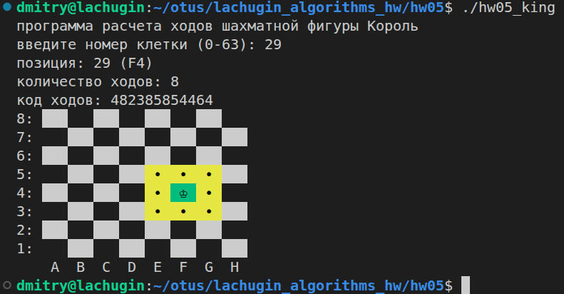
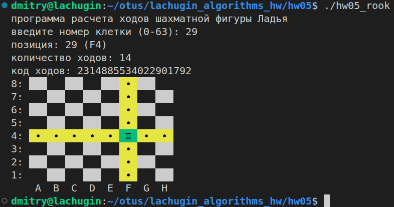
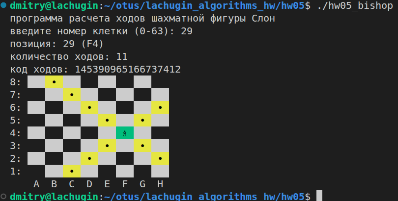
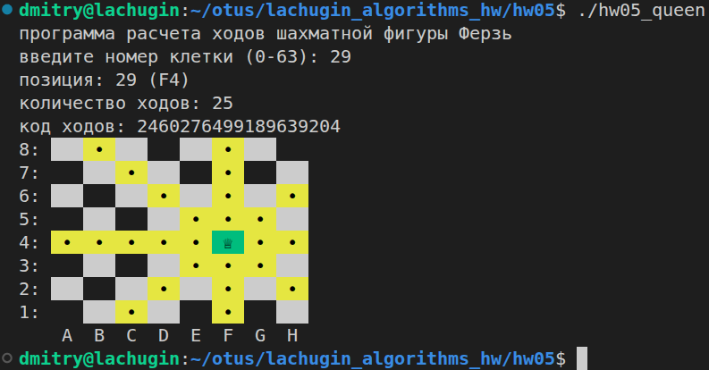

# ДЗ 05: Шахматные биты

## Цель

* Реализовать четырьмя способами алгоритмы подсчета количества установленных бит в числе
* Решить задачу Короля
* Решить задачу Коня
* Решить задачу Ладьи
* Решить задачу Слона
* Решить задачу Ферзя
* Написать систему тестирования и проверить алгоритмы по тестам из "0.Bits"

## Решение

Базовые функции для работы с шахматной доской реализованы тут `hw05/chess_board.h` в классе `ChessBoard`.  
Классы всех шахматных фигур являются наследниками от этого класса, и должны реализовать несколько виртуальных методов:

* **uint64_t move(uint32_t pos)** - тут реализуется алгоритм перемещения фигуры из заданной позиции (номера клетки). на выходе получается bitboard с возможными ходами фигуры
* **uint32_t popcount(uint64_t x)** - тут вызывается алгоритм для подсчета количества установленных бит в числе. каждая фигура использует свой алгоритм из четырех реализованных
* **std::string literal()** - метод, возвращающий символ фигуры (для процедуры отрисовки доски)

В последующих алгоритмах предполагается использование следующего bitboard:

```text
8:   56  57  58  59  60  61  62  63
7:   48  49  50  51  52  53  54  55
6:   40  41  42  43  44  45  46  47
5:   32  33  34  35  36  37  38  39
4:   24  25  26  27  28  29  30  31
3:   16  17  18  19  20  21  22  23
2:   08  09  10  11  12  13  14  15
1:   00  01  02  03  04  05  06  07
     --  --  --  --  --  --  --  --
     A   B   C   D   E   F   G   H
```

Сборка исходников происходит через `make`, проверялось в Linux.

```bash
dmitry@lachugin:~/lachugin_algorithms_hw/hw05$ make
g++ -lstdc++fs -std=c++17 -O2 -Wall -I. -o hw05_king main_king.cpp bit_count.cpp
g++ -lstdc++fs -std=c++17 -O2 -Wall -I. -o hw05_knight main_knight.cpp bit_count.cpp
g++ -lstdc++fs -std=c++17 -O2 -Wall -I. -o hw05_rook main_rook.cpp bit_count.cpp
g++ -lstdc++fs -std=c++17 -O2 -Wall -I. -o hw05_bishop main_bishop.cpp bit_count.cpp
g++ -lstdc++fs -std=c++17 -O2 -Wall -I. -o hw05_queen main_queen.cpp bit_count.cpp
g++ -lstdc++fs -std=c++17 -O2 -Wall -I. -o hw05_chess_checker checker.cpp checker_internals.cpp bit_count.cpp
```

### JUNIOR

#### 1. Алгоритмы подсчета количества единичных битов в числе

**1 а.** Реализован алгоритм простого подсчета установленных битов, через сдвиг (последовательно бит за битом) единичной маски влево и маскирования исходного числа. Сложность постоянная O(64).  
Исходники находятся в файле `hw05/bit_count.cpp`, в функции **popcount_v1()**.

**1 б.** Реализован алгоритм Кернигана для подсчета установленных битов, через последовательное объединение по Логическому-И числа и его же, но на единицу меньше. Сложность зависит от числа установленных бит. в худшем случае O(64).  
Исходники находятся в файле `hw05/bit_count.cpp`, в функции **popcount_v2()**.

#### 2. Задача про короля

Класс для фигуры Король реализован тут: `hw05/chess_king.h`.  
Для подсчета количества установленных битов реализует алгоритм **popcount_v1()** (итеративный алгоритм с маской).



#### 3. Задача про коня

Класс для фигуры Конь реализован тут: `hw05/chess_knight.h`.  
Для подсчета количества установленных битов реализует алгоритм **popcount_v2()** (алгоритм Кернигана).


### MIDDLE

#### 4. Алгоритмы подсчета количества единичных битов в числе через кэширование

**4 а.** Реализован для подсчета установленных битов, через кеширование по байтам. Сложность по памяти - 256 байт. Первый запуск потребует вычисления таблицы, по последующие запросы выполняются очень быстро. Сложность видимо будет O(8).  
Исходники находятся в файле `hw05/bit_count.cpp`, в функции **popcount_v3()** и **_popcount_cached_by_bytes()**.

**4 б.** Реализован для подсчета установленных битов, через кеширование по полубайтам. Сложность по памяти - 16 байт. Первый запуск потребует вычисления таблицы, по последующие запросы выполняются очень быстро. Сложность видимо будет O(16).  
Исходники находятся в файле `hw05/bit_count.cpp`, в функции **popcount_v4()** и **_popcount_cached_by_nibbles()**.

#### 5. Задача про ладью

Класс для фигуры Ладья реализован тут: `hw05/chess_rook.h`.  
Для подсчета количества установленных битов реализует алгоритм **popcount_v3()** (алгоритм с кешированием по байтам).



### SENIOR

#### 6. Задача про слона

Класс для фигуры Слон реализован тут: `hw05/chess_bishop.h`.  
Для подсчета количества установленных битов реализует алгоритм **popcount_v4()** (алгоритм с кешированием по нибблам).



#### 7. Задача про ферзя

Класс для фигуры Ферзь реализован тут: `hw05/chess_queen.h`.  
Т.к. его возможные ходы это комбинация ходов Слона и Ладьи, то для подсчета количества установленных битов их алгоритмы и используются, т.е. в одном случае **popcount_v4()**, а в другом **popcount_v3()**.



#### 8. Проверка всех алгоритмов через систему тестирования

```bash
dmitry@lachugin:~/lachugin_algorithms_hw/hw05$ ./hw05_chess_checker 

Результаты теста Короля

Test 0 (      1596 нс) : успех! ожидалось count='3' получено count='3' ожидалось moves='770' получено moves='770'
Test 1 (       355 нс) : успех! ожидалось count='5' получено count='5' ожидалось moves='1797' получено moves='1797'
Test 2 (       249 нс) : успех! ожидалось count='3' получено count='3' ожидалось moves='49216' получено moves='49216'
Test 3 (       252 нс) : успех! ожидалось count='5' получено count='5' ожидалось moves='197123' получено moves='197123'
Test 4 (       278 нс) : успех! ожидалось count='8' получено count='8' ожидалось moves='920078' получено moves='920078'
Test 5 (       257 нс) : успех! ожидалось count='5' получено count='5' ожидалось moves='12599488' получено moves='12599488'
Test 6 (       250 нс) : успех! ожидалось count='8' получено count='8' ожидалось moves='16186183351374184448' получено moves='16186183351374184448'
Test 7 (       250 нс) : успех! ожидалось count='5' получено count='5' ожидалось moves='13853283560024178688' получено moves='13853283560024178688'
Test 8 (       291 нс) : успех! ожидалось count='3' получено count='3' ожидалось moves='144959613005987840' получено moves='144959613005987840'
Test 9 (       294 нс) : успех! ожидалось count='3' получено count='3' ожидалось moves='4665729213955833856' получено moves='4665729213955833856'
------------------
Количество тестов: 10
Успешно          : 10
Провалено        : 0

Результаты теста Коня

Test 0 (       661 нс) : успех! ожидалось count='2' получено count='2' ожидалось moves='132096' получено moves='132096'
Test 1 (       261 нс) : успех! ожидалось count='3' получено count='3' ожидалось moves='329728' получено moves='329728'
Test 2 (       233 нс) : успех! ожидалось count='4' получено count='4' ожидалось moves='659712' получено moves='659712'
Test 3 (       246 нс) : успех! ожидалось count='8' получено count='8' ожидалось moves='11333767002587136' получено moves='11333767002587136'
Test 4 (       177 нс) : успех! ожидалось count='4' получено count='4' ожидалось moves='4620693356194824192' получено moves='4620693356194824192'
Test 5 (       140 нс) : успех! ожидалось count='3' получено count='3' ожидалось moves='288234782788157440' получено moves='288234782788157440'
Test 6 (       140 нс) : успех! ожидалось count='4' получено count='4' ожидалось moves='1152939783987658752' получено moves='1152939783987658752'
Test 7 (       139 нс) : успех! ожидалось count='3' получено count='3' ожидалось moves='2305878468463689728' получено moves='2305878468463689728'
Test 8 (       518 нс) : успех! ожидалось count='2' получено count='2' ожидалось moves='1128098930098176' получено moves='1128098930098176'
Test 9 (       291 нс) : успех! ожидалось count='2' получено count='2' ожидалось moves='9077567998918656' получено moves='9077567998918656'
------------------
Количество тестов: 10
Успешно          : 10
Провалено        : 0

Результаты теста Ладьи

Test 0 (      6743 нс) : успех! ожидалось count='14' получено count='14' ожидалось moves='72340172838076926' получено moves='72340172838076926'
Test 1 (       372 нс) : успех! ожидалось count='14' получено count='14' ожидалось moves='144680345676153597' получено moves='144680345676153597'
Test 2 (       268 нс) : успех! ожидалось count='14' получено count='14' ожидалось moves='289360691352306939' получено moves='289360691352306939'
Test 3 (       562 нс) : успех! ожидалось count='14' получено count='14' ожидалось moves='1157443723186933776' получено moves='1157443723186933776'
Test 4 (       655 нс) : успех! ожидалось count='14' получено count='14' ожидалось moves='9259541023762186368' получено moves='9259541023762186368'
Test 5 (       433 нс) : успех! ожидалось count='14' получено count='14' ожидалось moves='143553341945872641' получено moves='143553341945872641'
Test 6 (       299 нс) : успех! ожидалось count='14' получено count='14' ожидалось moves='4665518383679160384' получено moves='4665518383679160384'
Test 7 (       250 нс) : успех! ожидалось count='14' получено count='14' ожидалось moves='9259260648297103488' получено moves='9259260648297103488'
Test 8 (       264 нс) : успех! ожидалось count='14' получено count='14' ожидалось moves='18302911464433844481' получено moves='18302911464433844481'
Test 9 (       287 нс) : успех! ожидалось count='14' получено count='14' ожидалось moves='9187484529235886208' получено moves='9187484529235886208'
------------------
Количество тестов: 10
Успешно          : 10
Провалено        : 0

Результаты теста Слона

Test 0 (       590 нс) : успех! ожидалось count='7' получено count='7' ожидалось moves='9241421688590303744' получено moves='9241421688590303744'
Test 1 (       288 нс) : успех! ожидалось count='7' получено count='7' ожидалось moves='36099303471056128' получено moves='36099303471056128'
Test 2 (       331 нс) : успех! ожидалось count='7' получено count='7' ожидалось moves='141012904249856' получено moves='141012904249856'
Test 3 (       567 нс) : успех! ожидалось count='13' получено count='13' ожидалось moves='9386671504487645697' получено moves='9386671504487645697'
Test 4 (       377 нс) : успех! ожидалось count='7' получено count='7' ожидалось moves='2323857683139004420' получено moves='2323857683139004420'
Test 5 (       419 нс) : успех! ожидалось count='7' получено count='7' ожидалось moves='144117404414255168' получено moves='144117404414255168'
Test 6 (       289 нс) : успех! ожидалось count='9' получено count='9' ожидалось moves='11529391036782871041' получено moves='11529391036782871041'
Test 7 (       334 нс) : успех! ожидалось count='7' получено count='7' ожидалось moves='4611756524879479810' получено moves='4611756524879479810'
Test 8 (       343 нс) : успех! ожидалось count='7' получено count='7' ожидалось moves='567382630219904' получено moves='567382630219904'
Test 9 (       255 нс) : успех! ожидалось count='7' получено count='7' ожидалось moves='18049651735527937' получено moves='18049651735527937'
------------------
Количество тестов: 10
Успешно          : 10
Провалено        : 0

Результаты теста Ферзя

Test 0 (       865 нс) : успех! ожидалось count='21' получено count='21' ожидалось moves='9313761861428380670' получено moves='9313761861428380670'
Test 1 (       435 нс) : успех! ожидалось count='21' получено count='21' ожидалось moves='180779649147209725' получено moves='180779649147209725'
Test 2 (       413 нс) : успех! ожидалось count='21' получено count='21' ожидалось moves='289501704256556795' получено moves='289501704256556795'
Test 3 (       818 нс) : успех! ожидалось count='27' получено count='27' ожидалось moves='10544115227674579473' получено moves='10544115227674579473'
Test 4 (       607 нс) : успех! ожидалось count='21' получено count='21' ожидалось moves='11583398706901190788' получено moves='11583398706901190788'
Test 5 (       564 нс) : успех! ожидалось count='21' получено count='21' ожидалось moves='287670746360127809' получено moves='287670746360127809'
Test 6 (       648 нс) : успех! ожидалось count='23' получено count='23' ожидалось moves='16194909420462031425' получено moves='16194909420462031425'
Test 7 (       449 нс) : успех! ожидалось count='21' получено count='21' ожидалось moves='13871017173176583298' получено moves='13871017173176583298'
Test 8 (       484 нс) : успех! ожидалось count='21' получено count='21' ожидалось moves='18303478847064064385' получено moves='18303478847064064385'
Test 9 (       470 нс) : успех! ожидалось count='21' получено count='21' ожидалось moves='9205534180971414145' получено moves='9205534180971414145'
------------------
Количество тестов: 10
Успешно          : 10
Провалено        : 0

Сравнение затраченного времени на выполнение (нс)

Group name                Tets 0      Tets 1      Tets 2      Tets 3      Tets 4      Tets 5      Tets 6      Tets 7      Tets 8      Tets 9
queen                        865         435         413         818         607         564         648         449         484         470
bishop                       590         288         331         567         377         419         289         334         343         255
rook                        6743         372         268         562         655         433         299         250         264         287
knight                       661         261         233         246         177         140         140         139         518         291
king                        1596         355         249         252         278         257         250         250         291         294
```

По результатам видно, что алгоритмы работают корректно!

Также видно, что тесты фигуры Коня (knight) проходят быстрее, т.к. там используется алгоритм Кернигана, он очень быстрый, когда мало установленных бит в числе. А также в алгоритме не используются циклы, только битовые операции.

Тесты для фигуры Короля (king) проходят чуть дольше, чем тесты Коня, между ними разница только в алгоритме подсчета установленных бит. Для этй фигуры используется обычный итеративный алгоритм с маской.

В теста для фигуры Ладья (rook) видно, что первый прогон (тест) занял много времени, это потому что первоначально для алгоритма с кэширование по байтам требуется посчитать таблицу из 256 байт. Дальше время выполнения становится ощутимо меньше. Однако время выполнения всё равно больше чем для Короля и Коня, потому что в алгоритме применяются циклы, а не битовые операции.

Аналогично и с тестом фигуры Слон (bishop). Первый прогон (тест) потребовал вычисления таблицы из 16 байт для алгоритма подсчета с кэшированием по нибблам. Последующие тесты не требовали пересчета и прошли быстро. Однако время выполнения опять же больше, чем у Короля и Коня, потому что используются циклы, а не битовые операции.

Тест для фигуры Ферзь (queen) занял больше всего времени, потому что алгоритм хода ферзя - это комбинация алгоритмов слона и ладьи, а они работают через циклы.
