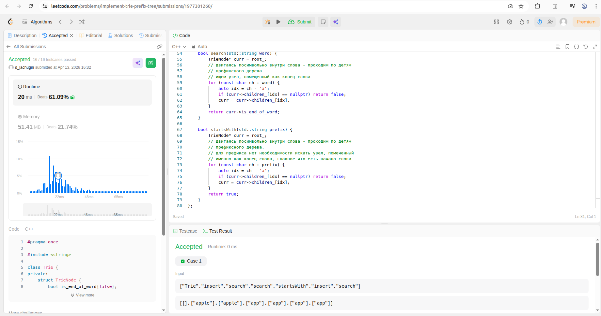

# ДЗ 13: Создание префиксного дерева (Trie)

## Цель

* реализовать ассоциативный массив на основе префиксного дерева
* сравнить эффективность добавления/поиска/удаления элементов в хэш-таблицу и в префиксное дерево

## Подготовка

Для сборки исходников запустить `make`:

```bash
dmitry@lachugin:~/otus/lachugin_algorithms_hw/hw13$ make
g++ -lstdc++fs -std=c++17 -O2 -Wall -I. -o hw13_hash main_hash.cpp
```

Мы будем рассматривать три варианта хэш-таблиц (реализованы в прошлом задании):

* использующую метод цепочек (с большим лимитом длины цепочек и с малым лимитом длины цепочек)
* использующую открытую адресацию с линейным пробингом и ленивым удалением
* использующую открытую адресацию с квадратичным пробингом и ленивым удалением

В этой работе реализуем префиксное дерево, и для сравнения с хэш-таблицами, сделаем класс наследником от интерфейса `IHashTable`.

Основными параметрами для теста этих алгоритмов будут выступать:

* количество коллизий:
  * для метода цепочек - когда при вставке цепочка для ключа уже не пуста
  * для открытой адресации - когда требуется более одной попытки
* фактор загрузки таблицы (load factor) - оценивается как отношение количества вставленных элементов к размеру таблицы
  * для метода цепочек делается рехэш таблицы по этому фактору, когда он больше 16.0 (средняя длина цепочки больше 16 элементов). по умолчанию в коде задано 3.0, но для теста увеличил, для наглядности
  * для открытой адресации делается рехэш таблицы по этому фактору, когда он больше 0.7. это значение жестко зашито в коде, не стал выносить
* количество операций рехэширования таблицы
* время, затраченное на вставку
* время, затраченное на поиск
* время, затраченное на удаление

**ПРИМЕЧАНИЕ:** для префиксного дерева нет такого понятия как рехэширование, следовательно не определен и фактор загрузки талицы (load factor), т.к. рехэширования не производится. Также по своей природе отсутствуют коллизии, т.е. префиксное дерево хранит в своей структуре данных все варианты, жертвуя при этом памятью (требуется намного больше памяти для хранения).

Тестирование будем проводить на парах ключ-значение формата (string, string). Потому что префиксное дерево работает со строковыми ключами. Для хэш-таблиц я старался делать реализацию шаблонную, чтобы можно было использовать с разными типами. Для того, чтобы из строковго ключа получить хэш-индекс реализован специальный хешер для строк (`hw13/Hasher.h`). Для него используется алгоритм, который в статьях в Интернете описывается как DJB2 алгоритм, и утверждается, что он выдаёт на практике хорошее распределение, при хорошей скорости.

Для тестирования подготовим набор произвольных данных из 10000 элементов, этот набор будет использоваться для теста вставки.  
Также будет сформирован набор для теста поиска, он будет состоять из 10% ключей из набора для вставки, с добавлением некоторого количества ключей, которых заведомо не существует.  
А также будет подготовлен набор для теста удаления, он будет состоять из 50% ключей из набора для вставки.

## Решение

### JUNIOR. Решить задачу на leetcode.com

Для решения задачи был реализован базовый класс префиксного дерева. Его исходники представлены тут: `hw13/Trie.h`.

Из основных ограничений - класс должен работать со строками, состоящими только из символов `'a'-'z'`. Поэтому была предложена подобная реализация с расчетом индекса по коду символа и определения его позиции в массиве с прямым доступом к элементам (у меня это std::vector, хотя можно было использовать и std::array и "сырой" (C-style) массив из 26 элементов).

Реализация успешно прошла тесты и показала неплохой результат:

```text
Runtime: 20ms      beats 61.09%
Memory:  51.41MB   beats 21.74%
```



В этом же тесте и проверяется основная отличительная функция префиксного дерева - поиск по префиксу.

### MIDDLE. Реализовать ассоциативный массив на основе префиксного дерева

Был разработан дополнительный класс **TrieTable** (исходники тут: `hw13/TrieTable.h`), реализующий тот же интерфейс `IHashTable` с шаблоном типов (std::string, V). Ключ всегда строка для префиксного дерева. Благодаря этому, можно будет без значительных доработок встроиться в уже существующую систему тестирования хэш-таблиц из прошлого ДЗ.

**ПРИМЕЧАНИЕ:** по постановке задания, мы должны сравнить реализации хэш-таблиц и префиксного дерева на операциях вставки/поиска/удаления.  
**Не требуется сравнивать различные префиксные операции** (есть ли в контейнере элементы, начинающиеся с символов, вывод ключей в алфавитном порядке и прочее), что специфично именно для префиксного дерева. Поэтому это в классе не разрабатывалось и не тестировалось. Тест специфичного префиксного функционала тестировался только при реализации класса в leetcode.

### SENIOR. Сравнить эффективность добавления/поиска/удаления элементов в хэш-таблицу и в префиксное дерево

Что тестируется и на каких данных - описано ранее. Посмотрим и проанализируем данные вывода программы.

```bash
dmitry@lachugin:~/otus/lachugin_algorithms_hw/hw13$ ./hw13_hash 
Программа оценки работы алгоритмов префиксного дерева и хэш-таблиц (Trie, ChainedHashTable, AddressingHashTable)

--- Оценка адекватности ChainedHashTable (avg_load=3) ---
0: 
1: 
2: [K='k_10' V='v_10'] => 
3: [K='k_47' V='v_47'] => [K='k_40' V='v_40'] => [K='k_93' V='v_93'] => [K='k_76' V='v_76'] => 
4: 
5: 
6: [K='k_55' V='v_55'] => 

--- Оценка адекватности AddressingHashTable (sequential) ---
0: 
1: 
2: [K='k_10' V='v_10']
3: [K='k_93' V='v_93']
4: [K='k_40' V='v_40']
5: 
6: 
7: 
8: 
9: 
10: [K='k_76' V='v_76']
11: [K='k_47' V='v_47']
12: 
13: [K='k_55' V='v_55']

--- Оценка адекватности AddressingHashTable (quadratic) ---
0: 
1: 
2: [K='k_10' V='v_10']
3: [K='k_40' V='v_40']
4: 
5: [K='k_93' V='v_93']
6: 
7: 
8: 
9: 
10: [K='k_47' V='v_47']
11: 
12: [K='k_76' V='v_76']
13: [K='k_55' V='v_55']

Hash table                              Inserted/Size/Time        Load  Collisions    Rehashes          Found/Size/Time        Removed/Size/Time   FinalSize
ChainedHashTable (avg_load=16)      10000/10000/8221849 ns     9.76562        8976           6      1000/1100/242784 ns      5000/5000/920905 ns        5000
ChainedHashTable (avg_load=2)       10000/10000/4997061 ns      1.2207        4192           9      1000/1100/241563 ns      5000/5000/727740 ns        5000
AddressingHashTable (sequential)    10000/10000/4127217 ns    0.610352        3045          10       1000/1100/97368 ns      5000/5000/338702 ns        5000
AddressingHashTable (quadratic)     10000/10000/2828488 ns    0.610352        3032          10       1000/1100/83197 ns      5000/5000/320326 ns        5000
TrieTable (std::array)             10000/10000/30261451 ns           0           0           0      1000/1100/454221 ns    5000/5000/12078301 ns        5000
```

В отличие от предыдущего ДЗ, тут ключом является строка, состоящая из 8 произвольных символов из набора `"abcdefghijklmnopqrstuvwxyzABCDEFGHIJKLMNOPQRSTUVWXYZ0123456789"`. Что обеспечивает очень хорошую рандомизацию и неповторяемость. Мы это видим из статистики по вставке: успешно вставлены 10000 элементов из 10000. В прошлом ДЗ для ключей из рандомных числел был некоторый процент повторений, что приводило не ко вставке нового значения, а к перезаписыванию существующего.

Надо заметить, что теперь тип ключа изменился, посчитать хэш-индекс от строки стало сложнее, это и отразилось на порядках времени выполнения. Если сравнивать с прошлой ДЗ, то например для **AddressingHashTable V2** с числовыми ключами для вставки имеем **2 170 747 ns** против **2 828 488 ns** сейчас.

С поправками на это, все 4 варианта хэш-таблиц имеют то же поведение и те же зависимости, что и в прошлом ДЗ. Такое же количество перестроений таблиц, очень похожие отношения фактора загрузки таблиц и очень похожие порядки по количеству коллизий. Лучше всего по производительности себя показывает **AddressingHashTable V2** (с квадратичным пробингом). А хуже всего - **ChainedHashTable** с большим лимитом на размер цепочки.

После добавления Trie в сравнение, видно следующее.

Ожидаемо, он работает медленнее чем любые из вариантов хэш-таблиц по всем из представленных операций (вставка, поиск элемента и удаление). Объясняется это очень просто. Для **Trie** нужно выполнить 8 операций доступа (в нашем случае ключи из строк длиной 8 символов) к узлам, пробираясь через префиксное древо вглубь. А для хэш-таблиц с открытой адресацией - достаточно выполнить всего одну операцию хэширования. Ну или несколько, при наличии коллизий. Для реализации по методу цепочек - тоже одну операцию хэширования и несколько операций перемещения по списку.

Отдельно хочется отметить очень медленную операцию удаления (даже в сравнении с операцией вставки). Удаление в **Trie** реализовано через рекурсивный проход вглубь (8 уровней) и подъема наверх с проверкой, можно ли удалить узел. Для этого линейно проходится массив из детей (128 штук) с проверкой на наличие узла-ребенка. Поэтому эта операция выходит значительно дороже, чем вставка.

В таблице этого не представлено для сравнения, но по памяти **Trie** также проигрывает. По грубым расчетам:

```text
10000 (ключей) * 8 (символов в ключе) = 80000 узлов
80000 (узлов) * 8 (байт в указателе) * 128 (мощность алфавита для детей) = 81,9 МБ
```

Грубо - **82 МБ** это только для указателей (т.е. просто сервисные нужды на поддержание структуры данных), без самих данных! Любая из представленных в сравнении хэш-таблиц будет значительно компактнее. Однако тут важно отметить, что префиксное дерево не имеет коллизий!

Также важно отметить, что тут не проверяется префиксный поиск, что является отличительной особенностью **Trie**. Именно в этой задаче префиксное дерево раскроется. Потому что для любого варианта хэш-таблиц - придется пересматривать всю таблицу! Поэтому для такой задачи **Trie** будет максимально выгодно смотреться и работать очень быстро.

Также важно отметить, что не проверяется задача вывести в алфавитном порядке все ключи со значениями. Эта задача также отлично решается структурой данных **Trie** простым обходом. Для любой хэш-таблицы потребуется не только обойти таблицу полностью, но и затем произвести сортировку.

В идеале, если задача стоит таким образом, что у нас заранее известен набор всех возможных ключей, то можно сформировать оптимальную структуру префиксного дерева **Trie**, в котором не будет использоваться лишних неиспользуемых узлов. Таким образом закроется минус по памяти. А если ещё по задаче будет требоваться префиксный поиск элементов - то структура **Trie** окажется лучшим выбором.
