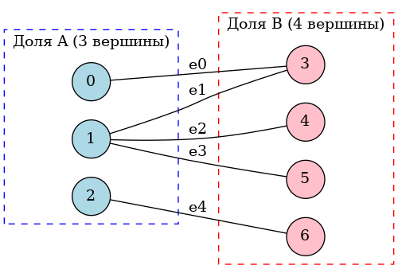

# ДЗ 14: Структуры данных для представления графов

## Цель

* реализовать несколько структур данных для представления графов

## Подготовка

Для сборки исходников запустить `make`:

```bash
lachugin@pop-os:~/otus/otus_algorithms_hw/hw14$ make
g++ -lstdc++fs -std=c++17 -O2 -Wall -I. -o hw14_graph main.cpp
```

## Решение

### JUNIOR

Будем работать с двудольным графом А(3,4) с 5 рёбрами следующего вида



#### Представление в виде перечисления множеств

Это обычное перечисление вершин графа и его ребер.  
Реализовано в `hw14/main.cpp` в **class GLists**. Реализовано на базе std::set и std::pair.

```bash
1. Перечисление множеств:
  Вершины: { 0 1 2 3 4 5 6 }
  Рёбра: { (0-3) (1-3) (1-4) (1-5) (2-6) }
```

#### Представление в виде матрицы смежности

Это двумерный массив (матрица VxV), где строки и столбцы - вершины. В ячейке матрицы 1 означает наличие ребра между указанными вершинами.  
Реализовано в `hw14/main.cpp` в **class GAdjMarix**. Реализовано на базе std::vector.

```bash
2. Матрица смежности (V x V):
     V_0 V_1 V_2 V_3 V_4 V_5 V_6 
     --- --- --- --- --- --- --- 
V_0:  0   0   0   1   0   0   0  
V_1:  0   0   0   1   1   1   0  
V_2:  0   0   0   0   0   0   1  
V_3:  1   1   0   0   0   0   0  
V_4:  0   1   0   0   0   0   0  
V_5:  0   1   0   0   0   0   0  
V_6:  0   0   1   0   0   0   0  
```

#### Представление в виде матрицы инцидентности

Это двумерный массив (матрица), строки - вершины графа, столбцы - рёбра графа. В ячейке матрицы 1 означает, что вершина инцидентна ребру, т.е. является либо его началом, либо его окончанием.  
Реализовано в `hw14/main.cpp` в **class GIncMarix**. Реализовано на базе std::vector.

```bash
3. Матрица инцидентности (V x E):
     E_0 E_1 E_2 E_3 E_4 
     --- --- --- --- --- 
V_0:  1   0   0   0   0  
V_1:  0   1   1   1   0  
V_2:  0   0   0   0   1  
V_3:  1   1   0   0   0  
V_4:  0   0   1   0   0  
V_5:  0   0   0   1   0  
V_6:  0   0   0   0   1  
```

### MIDDLE

#### Представление в виде перечня рёбер

Это протсой список пар вершин, где первая вершина - это начало ребра, а вторая вершина - конец ребра. В неоринетированном графе нет направления, поэтому ребра дублируют (искусственно создавая направления), чтобы не просматривать алгоритмом и первую и вторую вершины.  
Реализовано в `hw14/main.cpp` в **class GEdgeList**. Реализовано на базе std::vector и std::pair.

```bash
4. Перечень рёбер:
{ (0-3) (3-0) (1-3) (3-1) (1-4) (4-1) (1-5) (5-1) (2-6) (6-2) }
```

#### Представление в виде вектора смежности

Это матрица (двумерный массив), в которой строки - это вершины графа, а столбцы - номера (список) соседних вершин, с которыми есть соединение рёбрами. Количество столбцов равно величине максимальной степени вершин графа. Пусные ячейки матрицы заполняются невалидными значениями (например, -1) для формирования полной прямоугольной матрицы.  
Реализовано в `hw14/main.cpp` в **class GNeighboursVector**. Реализовано на базе std::vector.

```bash
5. Векторы смежности:
V_0:  3   *   *  
V_1:  3   4   5  
V_2:  6   *   *  
V_3:  0   1   *  
V_4:  1   *   *  
V_5:  1   *   *  
V_6:  2   *   *  
```

#### Представление в виде массива смежности

Это тоже самое что и вектор смежности, только это не прямоугольная матрица, а ступенчатый массив, в котором строки - это вершины графа, а количество столбцов в каждой строке разное. Это позволяет не выделять лишнюю память, представлять граф чуть компактнее, хотя может в чем-то менее удобнее из-за не полной приямоугольной матрицы.  
Реализовано в `hw14/main.cpp` в **class GNeighboursArray**. Реализовано на базе std::vector.

```bash
6. Массивы смежности:
V_0:  3  
V_1:  3   4   5  
V_2:  6  
V_3:  0   1  
V_4:  1  
V_5:  1  
V_6:  2  
```

#### Представление в виде списка смежности

Это тоже самое, что и вектор смежности, только это не прямоугольная матрица, а массив из списков, в котором строки - это вершины графа, а каждая строка это список номеров вершин, с которыми связана текущая вершина рёбрами. Это не прямоугольная матрица как в случае вектора смежности, и это не ступенчатый массив как в случае с массивом смежности. Тут используется связный список, что может быть полезно в случае, когда вершины добавляются, чтобы не перевыделять новые массивы в случае больших графов. Однако требует хранить метаданные в виде ссылок на соседние элементы списка.  
Реализовано в `hw14/main.cpp` в **class GNeighboursList**. Реализовано на базе std::vector и std::forward_list.

```bash
7. Списки смежности:
V_0:  3  
V_1:  5   4   3  
V_2:  6  
V_3:  1   0  
V_4:  1  
V_5:  1  
V_6:  2  
```

### SENIOR

#### Представление в виде структуры с оглавлением

В одном линейном массиве хранятся подряд одно за одним все массивы смежности, в одну строку. Сначала все соседи вершины 0, затем все соседи вершины 1 и т.д. В отдельном линейном массиве создается оглавление с указателями (индексами) на начало списка для каждой вершины.  
Реализовано в `hw14/main.cpp` в **class GIndexedEdgeList**. Реализовано на базе std::vector.

```bash
8. Структура с оглавлением:
Соседи каждой вершины:
V_0:  3  
V_1:  3   4   5  
V_2:  6  
V_3:  0   1  
V_4:  1  
V_5:  1  
V_6:  2  
Массив index: 0 1 4 5 7 8 9 10 
Массив edges: 3 3 4 5 6 0 1 1 1 2 
```

#### Представление в виде списка вершин и списка рёбер

Имеется список всех вершин графа, элементами этого спсика являются другие списки с инцедентными вершинами для этой вершины. По идее можно хранить еще и наименование ребра, но в нашем случае ребро однозначно характеризуется двумя вершинами и у него нет специального идентификатора.  
Реализовано в `hw14/main.cpp` в **class GVertexEdgeList**. Реализовано на базе std::vector.

```bash
9. Список вершин со списком рёбер:
V_0 -> { (3) }
V_1 -> { (3) (4) (5) }
V_2 -> { (6) }
V_3 -> { (0) (1) }
V_4 -> { (1) }
V_5 -> { (1) }
V_6 -> { (2) }
```
